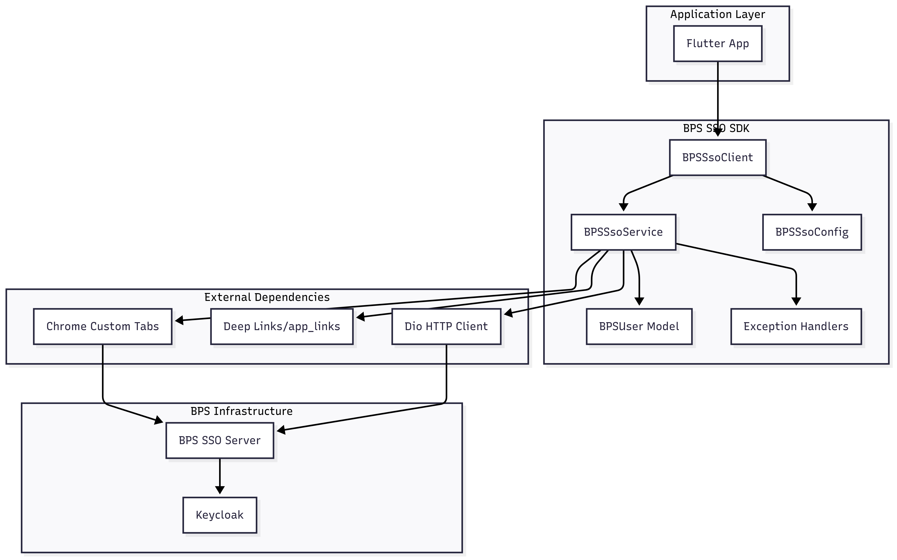

# BPS SSO SDK

A Flutter SDK for seamless integration with BPS (Badan Pusat Statistik) SSO authentication system using Chrome Custom Tabs. Features ISO 27001 compliant security, customizable UI, and enhanced error handling for government and enterprise applications.

## Table of Contents

- [Features](#features)
- [Architecture](#architecture)
- [Installation](#installation)
- [Setup](#setup)
- [Usage](#usage)
- [Security Configuration](#-security-configuration)
- [UI Customization](#-ui-customization)
- [Configuration Options](#configuration-options)
- [Enhanced Configuration Screen](#enhanced-configuration-screen)
- [OAuth2 Parameters](#oauth2-parameters)
- [Error Handling](#error-handling)
- [Troubleshooting](#troubleshooting)
- [Best Practices](#best-practices)
- [API Reference](#api-reference)
- [Requirements](#requirements)
- [Contributing](#contributing)
- [Workflows](#workflows)

## Features

### 🔐 Security & Compliance

- ✅ **ISO 27001 Compliant** - Enterprise-grade security for government use
- ✅ **Enhanced PKCE Implementation** - RFC 7636 compliant with entropy validation
- ✅ **Certificate Pinning** - SSL/TLS security for government endpoints
- ✅ **Runtime Security Checks** - Debug and root detection capabilities
- ✅ **Secure Token Storage** - Encrypted token storage with memory protection
- ✅ **Audit Logging** - Comprehensive security event logging
- ✅ **Privacy Mode** - Optional data obscuring for sensitive information

### 🎨 Customizable UI

- ✅ **Chrome Custom Tabs Customization** - Full UI theming and branding control
- ✅ **Government Branding Presets** - Pre-configured BPS visual identity
- ✅ **Security-Focused UI Options** - Disable sharing, bookmarks for secure environments
- ✅ **Custom Menu Items** - Add help, security info, and custom actions
- ✅ **Authenticated Image Loading** - Secure image loading with access tokens

### 🚀 Authentication & Integration

- ✅ **Chrome Custom Tabs Authentication** - Better user experience than WebView
- ✅ **OAuth2/OpenID Connect** - Secure authentication flow with PKCE
- ✅ **Multi-realm Support** - Internal and External BPS realms with different user structures
- ✅ **Type-Safe Configuration** - List-based parameters for better developer experience
- ✅ **Token Management** - Automatic token refresh and validation
- ✅ **Comprehensive Error Handling** - Production-safe error sanitization
- ✅ **Deep Link Integration** - Seamless OAuth callback handling
- ✅ **HTTP Interceptors** - Dio interceptor support for request/response modification
- ✅ **Authentication Callbacks** - Comprehensive callback system for auth events

### 🔧 Developer Experience

- ✅ **SDK Version Exposure** - Access to SDK version info for client applications
- ✅ **HTTP Request Debugging** - Built-in Alice integration for network inspection
- ✅ **Platform-Specific Optimization** - iOS-only Custom Tabs management
- ✅ **Enhanced Example App** - Comprehensive demo with all SDK features

## Architecture

### Authentication Flow Sequence Diagram


### SDK Architecture Diagram



## Installation

Add this to your package's `pubspec.yaml` file:

```yaml
dependencies:
  bps_sso_sdk: ^1.2.0
```

## Setup

### 1. Add Dependencies

Add the required dependencies to your `pubspec.yaml`:

```yaml
dependencies:
  bps_sso_sdk: ^1.2.0
  app_links: ^6.3.2 # For deep link handling
  # OR if using auto_route for navigation
  auto_route: ^10.1.2
```

### 2. Android Configuration

Add the following to your `android/app/src/main/AndroidManifest.xml`:

<details>
<summary>Click to expand Android configuration</summary>

```xml
<manifest xmlns:android="http://schemas.android.com/apk/res/android">
    <!-- Permissions for SSO authentication -->
    <uses-permission android:name="android.permission.INTERNET" />
    <uses-permission android:name="android.permission.ACCESS_NETWORK_STATE" />

    <application>
        <activity
            android:name=".MainActivity"
            android:exported="true"
            android:launchMode="singleTop"
            android:theme="@style/LaunchTheme">

            <!-- Regular launch intent -->
            <intent-filter>
                <action android:name="android.intent.action.MAIN"/>
                <category android:name="android.intent.category.LAUNCHER"/>
            </intent-filter>

            <!-- Deep link intent filters for SSO callback -->
            <intent-filter android:autoVerify="true">
                <action android:name="android.intent.action.VIEW" />
                <category android:name="android.intent.category.DEFAULT" />
                <category android:name="android.intent.category.BROWSABLE" />
                <!-- Replace 'your-app' with your actual app name -->
                <data android:scheme="id.go.bps" android:host="your-app-sso-internal" />
            </intent-filter>
            <intent-filter android:autoVerify="true">
                <action android:name="android.intent.action.VIEW" />
                <category android:name="android.intent.category.DEFAULT" />
                <category android:name="android.intent.category.BROWSABLE" />
                <!-- Replace 'your-app' with your actual app name -->
                <data android:scheme="id.go.bps" android:host="your-app-sso-eksternal" />
            </intent-filter>
        </activity>
    </application>
</manifest>
```

**Example configuration:**

```xml
<!-- Replace 'your-app' with your actual app name -->
<data android:scheme="id.go.bps" android:host="your-app-sso-internal" />
<data android:scheme="id.go.bps" android:host="your-app-sso-eksternal" />
```

</details>

### 3. iOS Configuration

Add the following to your `ios/Runner/Info.plist`:

<details>
<summary>Click to expand iOS configuration</summary>

```xml
<key>CFBundleURLTypes</key>
<array>
    <dict>
        <key>CFBundleURLName</key>
        <string>BPS SSO</string>
        <key>CFBundleURLSchemes</key>
        <array>
            <string>id.go.bps</string>
        </array>
    </dict>
</array>
```

</details>

## Usage

### 1. Initialize the SDK

Choose one of the following deep link handling approaches:

#### Option A: Using app_links package

<details>
<summary>Click to expand app_links implementation</summary>

```dart
import 'package:bps_sso_sdk/bps_sso_sdk.dart';
import 'package:app_links/app_links.dart';

class MyApp extends StatefulWidget {
  @override
  State<MyApp> createState() => _MyAppState();
}

class _MyAppState extends State<MyApp> {
  final _appLinks = AppLinks();

  @override
  void initState() {
    super.initState();
    _initializeSSO();
  }

  Future<void> _initializeSSO() async {
    // Configure BPS SSO SDK
    final config = BPSSsoConfig.create(
      appName: 'myapp', // Creates redirect URIs like 'id.go.bps://myapp-sso-internal'
      internalClientId: 'your-internal-client-id',
      externalClientId: 'your-external-client-id',
      responseTypes: ['code'],                          // OAuth2 response types
      scopes: ['openid', 'profile', 'email'],          // OAuth2 scopes
      codeChallengeMethod: 'S256',                     // PKCE method
    );

    // Optional: Debug incoming deep links
    _appLinks.stringLinkStream.listen((String link) {
      debugPrint('🔗 Received deep link: $link');
    });

    // Initialize the SDK
    BPSSsoClient.instance.initialize(
      config: config,
      linkStream: _appLinks.stringLinkStream,
    );
  }
}
```

</details>

#### Option B: Using auto_route for navigation and deep links

<details>
<summary>Click to expand auto_route implementation</summary>

```dart
import 'package:bps_sso_sdk/bps_sso_sdk.dart';
import 'package:auto_route/auto_route.dart';

// First, set up auto_route with deep link handling
@AutoRouterConfig()
class AppRouter extends _$AppRouter {
  @override
  RouteInformation? matcher(String location) {
    // Handle BPS SSO deep links
    final uri = Uri.parse(location);
    if (uri.scheme == 'id.go.bps' &&
        (uri.host == 'myapp-sso-internal' || uri.host == 'myapp-sso-eksternal')) {
      // This is an SSO callback, let the SDK handle it
      return null; // Or handle routing to login completion page
    }
    return super.matcher(location);
  }

  @override
  List<AutoRoute> get routes => [
    // Your app routes
    AutoRoute(page: LoginRoute.page, path: '/login', initial: true),
    AutoRoute(page: HomeRoute.page, path: '/home'),
  ];
}

class MyApp extends StatefulWidget {
  @override
  State<MyApp> createState() => _MyAppState();
}

class _MyAppState extends State<MyApp> {
  final _appRouter = AppRouter();

  @override
  void initState() {
    super.initState();
    _initializeSSO();
  }

  Future<void> _initializeSSO() async {
    // Configure BPS SSO SDK
    final config = BPSSsoConfig.create(
      appName: 'myapp',
      internalClientId: 'your-internal-client-id',
      externalClientId: 'your-external-client-id',
    );

    // Create a stream controller for deep links
    final linkController = StreamController<String>.broadcast();

    // Listen to auto_route deep links and forward to SDK
    _appRouter.urlFor(context, '/').listen((String url) {
      final uri = Uri.parse(url);
      if (uri.scheme == 'id.go.bps') {
        linkController.add(url);
      }
    });

    // Initialize the SDK
    BPSSsoClient.instance.initialize(
      config: config,
      linkStream: linkController.stream,
    );
  }

  @override
  Widget build(BuildContext context) {
    return MaterialApp.router(
      routerConfig: _appRouter.config(),
    );
  }
}
```

</details>

### 2. Authenticate User

```dart
class LoginPage extends StatelessWidget {
  Future<void> _loginInternal(BuildContext context) async {
    try {
      final user = await BPSSsoClient.instance.login(
        context: context,
        realmType: BPSRealmType.internal,
      );

      print('Logged in: ${user.displayName}');
      print('NIP: ${user.nip}');
      print('Organization: ${user.organization}');

      // Navigate to main app
    } catch (e) {
      if (e is AuthenticationCancelledException) {
        print('User cancelled authentication');
      } else if (e is NetworkException) {
        print('Network error: ${e.message}');
      } else {
        print('Authentication failed: $e');
      }
    }
  }

  Future<void> _loginExternal(BuildContext context) async {
    try {
      final user = await BPSSsoClient.instance.login(
        context: context,
        realmType: BPSRealmType.external,
      );

      // Handle external user login
    } catch (e) {
      // Handle error
    }
  }
}
```

### 3. Token Management

```dart
// Check if token needs refresh
if (BPSSsoClient.instance.shouldRefreshToken(user)) {
  try {
    final updatedUser = await BPSSsoClient.instance.refreshToken(user);
    // Save updated user
  } catch (e) {
    // Token refresh failed, redirect to login
  }
}

// Validate token
final isValid = await BPSSsoClient.instance.validateToken(user);
if (!isValid) {
  // Redirect to login
}

// Logout
await BPSSsoClient.instance.logout(user);
```

### 4. SDK Version Information

Access SDK version and metadata for client applications:

```dart
import 'package:bps_sso_sdk/bps_sso_sdk.dart';

// Get SDK version
String version = BPSSsoSdkInfo.version; // e.g., "1.1.0"

// Get SDK name
String name = BPSSsoSdkInfo.name; // "BPS SSO SDK"

// Get full SDK info
String fullInfo = BPSSsoSdkInfo.fullInfo; // "BPS SSO SDK v1.1.0"

// Get detailed metadata
Map<String, String> details = BPSSsoSdkInfo.details;
print('Version: ${details['version']}');
print('Description: ${details['description']}');
print('Homepage: ${details['homepage']}');
```

### 5. User Information

```dart
// Access user information
print('ID: ${user.id}');
print('Username: ${user.username}');
print('Full Name: ${user.fullName}');
print('Email: ${user.email}');
print('NIP: ${user.nip}');
print('Position: ${user.position}');
print('Organization: ${user.organization}');
print('Region: ${user.region}');
print('Province: ${user.province}');
print('Realm: ${user.realmDisplayName}');
print('Photo URL: ${user.photo}');
print('Office Address: ${user.address}');
print('Rank: ${user.rank}');
print('Old NIP: ${user.oldNip}');
print('First Name: ${user.firstName}');
print('Last Name: ${user.lastName}');

// Check user type
if (user.isInternal) {
  print('Internal BPS employee');
} else if (user.isExternal) {
  print('External BPS user');
}

// Check authentication status
if (user.isTokenExpired) {
  print('Token has expired');
} else {
  print('Token is valid until: ${user.tokenExpiry}');
}

// Check if user has photo
if (user.hasPhoto) {
  print('User has profile photo');
}

// Get user initials for avatar
Text(user.initials); // e.g., "JD" for John Doe
```

## Configuration Options

### Configuration Flow Diagram


### Easy Configuration (Recommended)

Use the factory method for standard BPS SSO setup:

```dart
final config = BPSSsoConfig.create(
  appName: 'myapp', // Your app identifier
  internalClientId: 'your-internal-client-id',
  externalClientId: 'your-external-client-id',
);
```

This automatically creates:

- Internal redirect URI: `id.go.bps://myapp-sso-internal`
- External redirect URI: `id.go.bps://myapp-sso-eksternal`
- Standard BPS realms: `pegawai-bps` (internal) and `eksternal` (external)

### Custom OAuth2 Parameters

```dart
final config = BPSSsoConfig.create(
  appName: 'myapp',
  internalClientId: 'your-internal-client-id',
  externalClientId: 'your-external-client-id',
  responseTypes: ['code'],                           // OAuth2 response types
  scopes: ['openid', 'profile', 'email', 'roles'],   // Custom scopes
  codeChallengeMethod: 'S256',                       // PKCE method
);
```

### Custom Realm Names

Override the default realm names for internal and external realms:

```dart
final config = BPSSsoConfig.create(
  appName: 'myapp',
  internalClientId: 'your-internal-client-id',
  externalClientId: 'your-external-client-id',
  internalRealmName: 'custom-internal-realm',    // Override default 'pegawai-bps'
  externalRealmName: 'custom-external-realm',    // Override default 'eksternal'
);
```

**Default behavior:** If `internalRealmName` and `externalRealmName` are `null` (default), the SDK uses the standard BPS realm names:
- Internal realm: `pegawai-bps`
- External realm: `eksternal`

**Use cases for custom realm names:**
- Testing with different Keycloak realm configurations
- Integration with custom or development SSO environments
- Multi-tenant setups with organization-specific realms

### Enhanced Configuration Screen

The example application includes a comprehensive configuration screen that supports all SDK features:

#### Visual Configuration Interface

The configuration screen provides an intuitive UI for setting up the SDK with real-time validation:

```dart
// Configuration screen features:
- General settings (Base URL, HTTP inspection)
- Internal BPS Realm configuration with custom realm names
- External BPS Realm configuration with custom realm names
- Advanced OAuth2 parameters (response types, scopes, PKCE methods)
- Real-time form validation and error handling
- Live preview of configuration changes
```

#### Realm Name Configuration

Users can configure custom realm names directly in the UI:

- **Internal Realm Field**: Allows customization of the internal BPS realm name
  - Default: `pegawai-bps`
  - Placeholder hint: "pegawai-bps (default)"
  - Real-time validation and state updates

- **External Realm Field**: Allows customization of the external BPS realm name
  - Default: `eksternal`
  - Placeholder hint: "eksternal (default)"
  - Real-time validation and state updates

#### Configuration Persistence

The configuration screen uses `HydratedBlocCubit` for state persistence:

```dart
// Configuration automatically saved and restored
ConfigurationState({
  baseUrl: 'https://sso.bps.go.id',
  internalRealm: 'pegawai-bps',        // Configurable via UI
  externalRealm: 'eksternal',          // Configurable via UI
  // ... other configuration options
});
```

#### Advanced Features

- **HTTP Inspector Integration**: Built-in Alice HTTP debugging
- **Multi-Select Chips**: For OAuth2 scopes and response types
- **Dropdown Fields**: For code challenge methods
- **Form Validation**: Real-time validation with error messages
- **Loading States**: Visual feedback during SDK initialization
- **Error Display**: User-friendly error messages with retry options

### HTTP Interceptors

Add Dio interceptors for request/response modification, logging, or debugging:

```dart
import 'package:alice/alice.dart';
import 'package:alice_dio/alice_dio_adapter.dart';

// Create Alice for HTTP debugging
final alice = Alice();
final aliceAdapter = AliceDioAdapter();
alice.addAdapter(aliceAdapter);

final config = BPSSsoConfig.create(
  appName: 'myapp',
  internalClientId: 'your-internal-client-id',
  externalClientId: 'your-external-client-id',
  interceptors: [
    aliceAdapter,  // HTTP debugging
    // Add other Dio interceptors here
  ],
);

// Show network inspector
alice.showInspector();
```

### Authentication Callbacks

Handle authentication events with comprehensive callback system:

```dart
final config = BPSSsoConfig.create(
  appName: 'myapp',
  internalClientId: 'your-internal-client-id',
  externalClientId: 'your-external-client-id',
  authCallbacks: BPSSsoAuthCallback(
    onLoginSuccess: (user, realmType) {
      print('Login successful for ${user.fullName} in $realmType realm');
      // Handle successful login
    },
    onLoginFailed: (error, realmType) {
      print('Login failed in $realmType realm: $error');
      // Handle login failure
    },
    onLoginCancelled: (realmType) {
      print('Login cancelled for $realmType realm');
      // Handle user cancellation
    },
    onLogoutSuccess: (user) {
      print('Logout successful for ${user.fullName}');
      // Handle successful logout
    },
    onLogoutFailed: (error, user) {
      print('Logout failed for ${user.fullName}: $error');
      // Handle logout failure
    },
    onTokenRefreshSuccess: (user) {
      print('Token refreshed for ${user.fullName}');
      // Handle successful token refresh
    },
    onTokenRefreshFailed: (error, user) {
      print('Token refresh failed for ${user.fullName}: $error');
      // Handle token refresh failure
    },
    onAuthenticationFailure: (error, user) {
      print('Authentication failure for ${user?.fullName}: $error');
      // Handle general authentication failures
    },
  ),
);
```

## 🔐 Security Configuration

The SDK provides enterprise-grade security configurations for different environments:

### ISO 27001 Compliant (Government/Enterprise)

```dart
final config = BPSSsoConfig.create(
  appName: 'government-app',
  internalClientId: 'gov-internal-client',
  externalClientId: 'gov-external-client',
  // Automatically uses ISO 27001 compliant security settings
);
```

### Development Configuration

```dart
final config = BPSSsoConfig.create(
  appName: 'dev-app',
  internalClientId: 'dev-internal-client',
  externalClientId: 'dev-external-client',
  securityConfig: BPSSsoSecurityConfig.iso27001,
  errorConfig: const BPSSsoErrorConfig(),
);
```

### Security Features

- **Certificate Pinning**: SSL/TLS security for government endpoints
- **Enhanced PKCE**: RFC 7636 compliant with entropy validation
- **Secure Token Storage**: Encrypted token storage with memory protection
- **Runtime Security Checks**: Debug and root detection
- **Audit Logging**: Comprehensive security event logging
- **Error Sanitization**: Production-safe error messages
- **Deep Link Validation**: Security validation for OAuth callback URLs
- **State Parameter Verification**: CSRF protection for OAuth flows
- **Token Expiry Management**: Automatic token validation and refresh

## 🎨 UI Customization

Customize the Chrome Custom Tabs appearance and behavior:

### Government Branding (Default)

```dart
final config = BPSSsoConfig.create(
  appName: 'myapp',
  internalClientId: 'your-internal-client-id',
  externalClientId: 'your-external-client-id',
  // Uses BPS default branding automatically
);
```

### Custom UI Configuration

```dart
final config = BPSSsoConfig.create(
  appName: 'myapp',
  internalClientId: 'your-internal-client-id',
  externalClientId: 'your-external-client-id',
  customTabsConfig: BPSSsoCustomTabConfig(
    toolbarColor: Color(0xFF2196F3),     // Custom color
    enableUrlBarHiding: false,           // Keep URL visible
    showTitle: true,
    enableDefaultShare: false,           // Disable for security
    customMenuItems: [
      CustomTabMenuItem(
        title: 'Help',
        icon: Icons.help,
        onTap: () => showHelpDialog(),
      ),
    ],
  ),
);
```

### High Security UI

```dart
final config = BPSSsoConfig.create(
  appName: 'secure-app',
  internalClientId: 'secure-internal-client',
  externalClientId: 'secure-external-client',
  customTabsConfig: BPSSsoCustomTabConfig.secure, // Disables sharing, bookmarks, downloads
);
```

### Full Custom Configuration

<details>
<summary>Click to expand custom configuration example</summary>

```dart
// For advanced use cases with custom realms or endpoints
const config = BPSSsoConfig(
  baseUrl: 'https://your-sso-server.com', // Optional
  internal: BPSRealmConfig(
    clientId: 'your-internal-client-id',
    redirectUri: 'id.go.bps://your-app-sso-internal',
    realm: 'pegawai-bps',
    realmType: BPSRealmType.internal,
    responseTypes: ['code'],                               // Configurable response types
    scopes: ['openid', 'profile', 'email', 'custom'],      // Configurable scopes
    codeChallengeMethod: 'S256',                           // Configurable PKCE method
  ),
  external: BPSRealmConfig(
    clientId: 'your-external-client-id',
    redirectUri: 'id.go.bps://your-app-sso-eksternal',
    realm: 'eksternal',
    realmType: BPSRealmType.external,
    responseTypes: ['code'],
    scopes: ['openid', 'profile', 'email'],
    codeChallengeMethod: 'plain',                          // Different PKCE method
  ),
);
```

</details>

## OAuth2 Parameters

The SDK supports configurable OAuth2 parameters with type-safe lists:

### Response Types (List\<String\>)

Default: `['code']`

Common values:

- `['code']` - Authorization code flow with PKCE (recommended)
- `['token']` - Implicit flow (not recommended for mobile apps)
- `['id_token']` - OpenID Connect implicit flow
- `['code', 'token']` - Hybrid flow
- `['code', 'id_token']` - Hybrid flow with ID token
- `['token', 'id_token']` - Implicit flow with ID token
- `['code', 'token', 'id_token']` - Full hybrid flow

### Scopes (List\<String\>)

Default: `['openid', 'profile', 'email']`

Common values:

- `['openid']` - Basic OpenID Connect
- `['openid', 'profile']` - With user profile information
- `['openid', 'profile', 'email']` - Standard set (default)
- `['openid', 'profile', 'email', 'roles']` - Include user roles
- `['openid', 'profile', 'email', 'groups']` - Include user groups
- `['openid', 'profile', 'email', 'offline_access']` - For refresh tokens

### Code Challenge Method (String)

Default: `'S256'`

Supported values:

- `'S256'` - SHA256 hash method (recommended)
- `'plain'` - Plain text method (less secure, use only if S256 not supported)

## Error Handling

### Error Flow Diagram


The SDK provides specific exception types:

```dart
try {
  final user = await BPSSsoClient.instance.login(
    context: context,
    realmType: BPSRealmType.internal
  );
} catch (e) {
  if (e is AuthenticationCancelledException) {
    // User cancelled the authentication
  } else if (e is TokenExchangeException) {
    // Failed to exchange authorization code for tokens
  } else if (e is MissingUserDataException) {
    // Required user data is missing from the response
  } else if (e is NetworkException) {
    // Network-related error
  } else if (e is BPSSsoException) {
    // Other SSO-specific error
  }
}
```

### Required Configuration

⚠️ **Important**: Configuration is now required! You must provide your own client IDs and redirect URIs. The SDK no longer includes default values to ensure each app uses its own credentials.

### User Type Support

The SDK supports different user structures for internal and external realms:

#### Internal Users (BPS Employees)
- Full employee data including NIP, organization, position, rank
- Office location information (region, province, address)
- Complete profile data with photos

#### External Users (Third-party)
- Basic profile information (name, email, username)
- Simplified structure without employee-specific fields
- OAuth standard fields (given_name, family_name)

### Example App Configuration

```dart
// Example configuration for a BPS application
final config = BPSSsoConfig.create(
  appName: 'myapp',
  internalClientId: 'internal-client-id',
  externalClientId: 'external-client-id',
  // Additional configuration for callbacks and UI
  authCallbacks: BPSSsoAuthCallbacks(
    onLoginSuccess: (user, realm) {
      print('Login successful for ${user.fullName}');
    },
    onLoginFailed: (error, realm) {
      print('Login failed: $error');
    },
    onTokenRefreshSuccess: (user) {
      print('Token refreshed for ${user.fullName}');
    },
  ),
);
```

## Troubleshooting

### Deep Link Issues

If the app gets stuck in Chrome Custom Tabs and doesn't redirect back:

#### 1. Check Android Manifest Configuration

```bash
# Verify intent filters are properly configured
# Make sure android:host matches your BPSSsoConfig appName
```

#### 2. Verify iOS Info.plist

```bash
# Ensure CFBundleURLSchemes includes "id.go.bps"
```

#### 3. Test Deep Links

<details>
<summary>Click to expand deep link testing commands</summary>

```bash
# Android: Test with adb
adb shell am start \
  -W -a android.intent.action.VIEW \
  -d "id.go.bps://your-app-sso-internal?code=test&state=test" \
  your.package.name

# iOS: Test with Simulator
xcrun simctl openurl booted "id.go.bps://your-app-sso-internal?code=test&state=test"
```

</details>

#### 4. Enable Debug Logging

```dart
// Add this to see incoming deep links
_appLinks.stringLinkStream.listen((String link) {
  debugPrint('🔗 Received deep link: $link');
});
```

#### 5. Common Issues

- **Wrong redirect URI**: Ensure your `appName` in `BPSSsoConfig.create()` matches the Android manifest host
- **Multiple listeners**: Only one app should listen to the same deep link scheme
- **Android autoVerify**: Remove `android:autoVerify="true"` if causing issues
- **iOS Universal Links**: Disable if conflicting with custom URL schemes

### Authentication Errors

- **`AuthenticationCancelledException`**: User cancelled or deep link failed
- **`TokenExchangeException`**: Check client ID and redirect URI configuration
- **`NetworkException`**: Check internet connection and SSO server accessibility
- **`MissingUserDataException`**: SSO server didn't return required user fields

## Best Practices

### 🔐 Security Recommendations

1. **Use ISO 27001 Configuration for Production**

   ```dart
   // Recommended for government/enterprise apps
   final config = BPSSsoConfig.create(
     appName: 'your-app',
     internalClientId: 'your-internal-client',
     externalClientId: 'your-external-client',
     securityConfig: BPSSsoSecurityConfig.iso27001, // Default
   );
   ```

2. **Enable Security Features**

   - ✅ Certificate pinning for production
   - ✅ Token encryption for sensitive data
   - ✅ Runtime security checks
   - ✅ Audit logging for compliance

3. **Handle Errors Securely**

   ```dart
   try {
     final user = await BPSSsoClient.instance.login(context: context, realmType: realmType);
   } catch (e) {
     // Use sanitized error messages in production
     showError(_getSecureErrorMessage(e));
   }
   ```

4. **UI Security**
   - Use `BPSSsoCustomTabConfig.secure` for high-security environments
   - Keep URL bar visible for transparency when needed
   - Disable sharing/bookmarks for sensitive applications

### Usage Examples

<details>
<summary>Click to expand usage examples</summary>

#### Standard OAuth2 Flow (Recommended)

```dart
// Default configuration - most secure
final config = BPSSsoConfig.create(
  appName: 'myapp',
  internalClientId: 'your-internal-client-id',
  externalClientId: 'your-external-client-id',
  // Uses defaults: responseTypes: ['code'], scopes: ['openid', 'profile', 'email'], codeChallengeMethod: 'S256'
);
```

#### Custom Scopes for Additional Data

```dart
// Request additional scopes for more user data
final config = BPSSsoConfig.create(
  appName: 'myapp',
  internalClientId: 'your-internal-client-id',
  externalClientId: 'your-external-client-id',
  scopes: ['openid', 'profile', 'email', 'roles', 'groups'], // Request roles and groups
);
```

#### Legacy System Compatibility

```dart
// Use plain PKCE method for older systems that don't support S256
final config = BPSSsoConfig.create(
  appName: 'myapp',
  internalClientId: 'your-internal-client-id',
  externalClientId: 'your-external-client-id',
  codeChallengeMethod: 'plain', // Less secure but compatible
);
```

#### Per-Realm Configuration

```dart
// Different settings for internal vs external realms
const config = BPSSsoConfig(
  internal: BPSRealmConfig(
    clientId: 'internal-client-id',
    redirectUri: 'id.go.bps://myapp-sso-internal',
    realm: 'pegawai-bps',
    realmType: BPSRealmType.internal,
    scopes: ['openid', 'profile', 'email', 'roles'],  // More scopes for internal users
    codeChallengeMethod: 'S256',                       // Secure method
  ),
  external: BPSRealmConfig(
    clientId: 'external-client-id',
    redirectUri: 'id.go.bps://myapp-sso-eksternal',
    realm: 'eksternal',
    realmType: BPSRealmType.external,
    scopes: ['openid', 'profile', 'email'],            // Basic scopes for external users
    codeChallengeMethod: 'plain',                      // Legacy compatibility
  ),
);
```

</details>

### Security Recommendations

1. **OAuth2 Security**

   - Always use `responseTypes: ['code']` with PKCE for mobile apps
   - Prefer `codeChallengeMethod: 'S256'` over `'plain'`
   - Request minimal scopes needed for your app functionality

2. **Handle Multiple Deep Link Sources**

```dart
// If using both app_links and auto_route
Stream<String> combinedLinkStream = StreamGroup.merge([
  _appLinks.stringLinkStream,
  _autoRouteLinkStream,
]);
```

3. **Graceful Timeout Handling**

```dart
try {
  final user = await BPSSsoClient.instance.login(
    context: context,
    realmType: BPSRealmType.internal,
  );
} on AuthenticationCancelledException {
  // Handle user cancellation gracefully
  showSnackBar('Login cancelled');
}
```

4. **Test on Real Devices**
   - Chrome Custom Tabs behavior differs between emulator and real devices
   - Always test deep links on physical devices
   - Test with different OAuth2 parameter combinations

## API Reference

### Main Classes

| Class            | Description                              |
| ---------------- | ---------------------------------------- |
| `BPSSsoClient`   | Main SDK client singleton                |
| `BPSSsoConfig`   | SDK configuration                        |
| `BPSRealmConfig` | Realm-specific configuration             |
| `BPSUser`        | User model with authentication data      |
| `BPSRealmType`   | Enum for realm types (internal/external) |
| `BPSSsoSdkInfo`  | SDK version and metadata information     |

### Methods

| Method                           | Description                       |
| -------------------------------- | --------------------------------- |
| `initialize(config, linkStream)` | Initialize SDK with configuration |
| `login(context, realmType)`      | Authenticate user                 |
| `refreshToken(user)`             | Refresh access token              |
| `validateToken(user)`            | Validate current token            |
| `logout(user)`                   | Logout user                       |
| `shouldRefreshToken(user)`       | Check if token needs refresh      |

### Exceptions

| Exception                          | Description                   |
| ---------------------------------- | ----------------------------- |
| `AuthenticationCancelledException` | User cancelled authentication |
| `TokenExchangeException`           | Token exchange failed         |
| `NetworkException`                 | Network error occurred        |
| `MissingUserDataException`         | Required user data missing    |
| `BPSSsoException`                  | Base exception class          |

## Requirements

- Flutter 3.0.0 or higher

### Supported Platforms

- ✅ **Android** API level 21 or higher (for Chrome Custom Tabs)
- ✅ **iOS** 12.0 or higher
- ❌ **Web** - Not supported (Custom Tabs unavailable)
- ❌ **Desktop** (macOS, Windows, Linux) - Not supported

## Dependencies

### Core Dependencies

- `dio` - HTTP client for API calls and request/response handling
- `flutter_custom_tabs` - Chrome Custom Tabs implementation (iOS-optimized)
- `crypto` - PKCE cryptographic functions for OAuth2 security
- `url_launcher` - URL launching utilities
- `intl` - Internationalization and date formatting
- `uuid` - UUID generation for state parameters

### Optional Dependencies for Enhanced Features

- `alice` - HTTP request/response debugging inspector
- `alice_dio` - Dio adapter for Alice HTTP debugging
- `app_links` - Deep link handling for OAuth callbacks

### Platform-Specific Optimizations

- **iOS**: Custom Tabs management optimized for SFSafariViewController
- **Android**: Chrome Custom Tabs with enhanced security configurations
- **Cross-platform**: Unified API with platform-specific implementations

## Contributing

We welcome contributions to the BPS SSO SDK! Please see our [Contributing Guidelines](CONTRIBUTING.md) for detailed information on:

- Development setup and environment
- Git Flow workflow and branching strategy
- Coding standards and style guidelines
- Testing requirements and coverage
- Pull request process and templates
- Issue reporting guidelines

### Quick Start for Contributors

1. **Fork and clone** the repository
2. **Create a feature branch** from `develop`
3. **Make your changes** following our coding standards
4. **Run tests** and ensure they pass
5. **Submit a pull request** to the `develop` branch

For detailed instructions, see [CONTRIBUTING.md](CONTRIBUTING.md).

## Workflows

This repository uses automated GitHub Actions workflows for CI/CD. See our [Workflows Documentation](WORKFLOWS.md) for detailed information on:

- **CI Pipeline**: Automated testing, analysis, and quality checks
- **Release Process**: Automated versioning, tagging, and publishing
- **Git Flow Integration**: Branch-based workflow automation
- **Manual Triggers**: How to manually run workflows
- **Troubleshooting**: Common issues and solutions

### Workflow Overview


For complete workflow documentation, see [WORKFLOWS.md](WORKFLOWS.md).

## License

This project is licensed under the MIT License - see the [LICENSE](LICENSE) file for details.

## Support

For issues or questions:

- **Bug Reports**: Create an issue using our [bug report template](.github/ISSUE_TEMPLATE/bug_report.md)
- **Feature Requests**: Create an issue using our [feature request template](.github/ISSUE_TEMPLATE/feature_request.md)
- **Questions**: Start a discussion in our [GitHub Discussions](../../discussions)
- **Security Issues**: Email the maintainers directly (see [SECURITY.md](SECURITY.md))

## Example Application

The SDK includes a comprehensive example application demonstrating:

- Complete OAuth2 authentication flow
- User interface with privacy mode toggle
- Authenticated image loading for user avatars
- Real-time initialization status checking
- Proper error handling and user feedback
- Navigation with deep link integration
- State management with Cubit/Bloc pattern

To run the example:

```bash
cd example
flutter pub get
flutter run
```

### Example Features

- **Home Screen**: Shows SDK initialization status and authentication state
- **Configuration Screen**: Comprehensive SDK setup with custom realm names support
- **Operations Screen**: Login/logout functionality with real-time status
- **User Info Screen**: Detailed user information with privacy controls
- **Privacy Mode**: Toggle to obscure sensitive information
- **Status Cards**: Visual feedback for all operations
- **Error Handling**: User-friendly error messages and recovery
- **HTTP Inspector**: Built-in Alice integration for network debugging
- **Real-time Validation**: Form validation with immediate feedback

## Changelog

### Version 1.0.0

- Initial release with Chrome Custom Tabs authentication
- OAuth2/OIDC support with PKCE
- Multi-realm support (internal/external)
- Type-safe configuration with lists
- Comprehensive error handling
- Token management functionality
- External user structure support
- Privacy mode for sensitive data
- Authenticated image loading
- Enhanced deep link handling
- Real-time SDK status checking
- Complete example application
