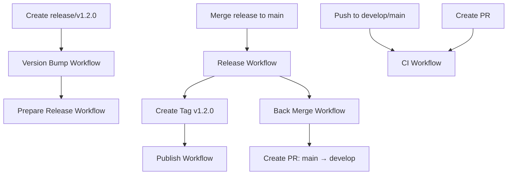
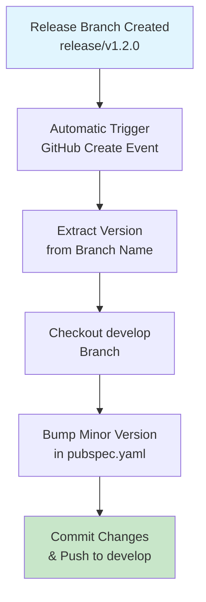
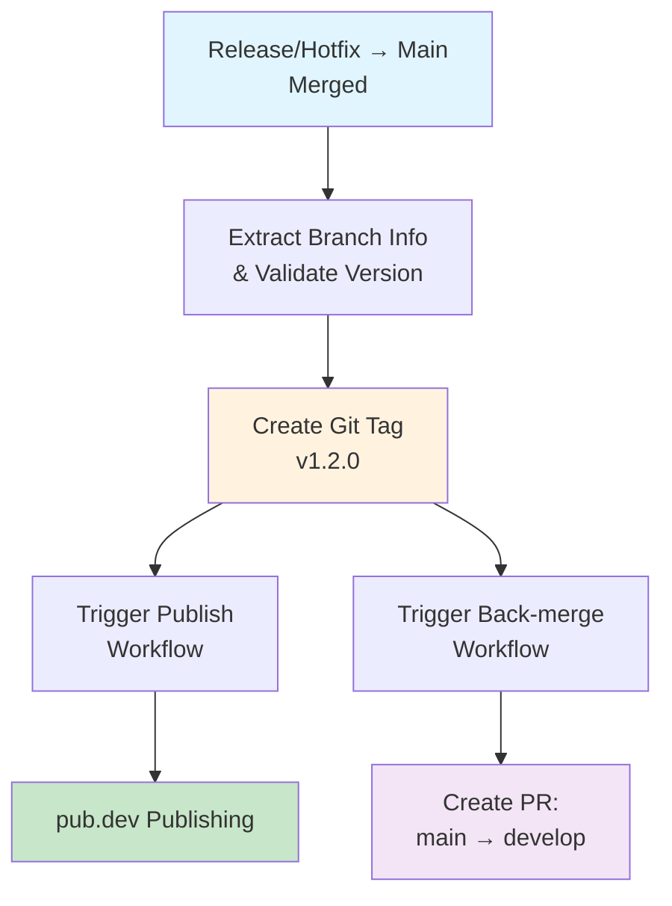
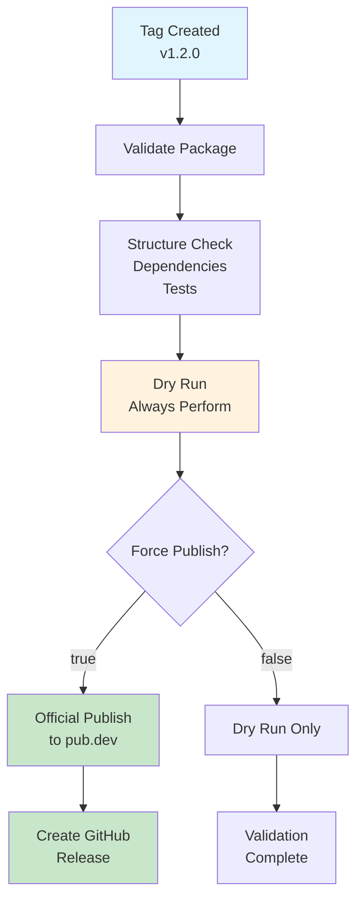
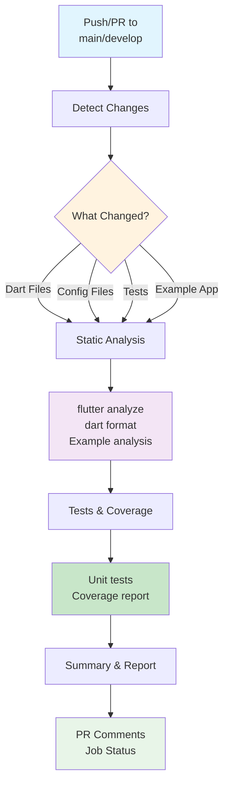

# GitHub Actions Workflows

This document describes the automated workflows configured for the BPS SSO SDK repository.

## Table of Contents

- [Workflow Overview](#workflow-overview)
- [CI/CD Pipeline](#cicd-pipeline)
- [Git Flow Integration](#git-flow-integration)
- [Workflow Diagrams](#workflow-diagrams)
- [Manual Triggers](#manual-triggers)
- [Troubleshooting](#troubleshooting)

## Workflow Overview

Our repository uses 6 main GitHub Actions workflows:

| Workflow | Trigger | Purpose | Status |
|----------|---------|---------|---------|
| **CI** | Push/PR to main/develop | Code quality, testing, analysis | ✅ Active |
| **Version Bump** | Release branch creation | Automatic minor version increment | ✅ Active |
| **Prepare Release** | Release/hotfix branch creation | Release preparation and validation | ✅ Active |
| **Release** | Release/hotfix merged to main | Tag creation and release process | ✅ Active |
| **Publish** | Tag creation or manual trigger | pub.dev package publishing | ✅ Active |
| **Back Merge** | Release/hotfix merged to main | Sync changes back to develop | ✅ Active |

## CI/CD Pipeline

### Continuous Integration (CI)

**File**: `.github/workflows/ci.yml`

**Triggers:**
- Push to `main` or `develop` branches
- Pull requests to `main` or `develop` branches

**Features:**
- **Smart execution** - Only runs relevant jobs based on changed files
- **Sequential execution** - Test runs after analyze to optimize resource usage
- **Automatic permissions** for PR comments
- **Coverage reporting** with PR comments
- **Multiple validations**: static analysis, formatting, tests

**Flow:**
```
┌─────────────────┐    ┌──────────────┐    ┌────────────────┐
│ Detect Changes  │───▶│   Analyze    │───▶│      Test      │
│ (Smart Trigger) │    │ + Format     │    │ + Coverage     │
└─────────────────┘    └──────────────┘    └────────────────┘
                                                    │
                       ┌─────────────────────────────┘
                       ▼
                ┌──────────────┐
                │  CI Summary  │
                │ (PR Comment) │
                └──────────────┘
```

### Continuous Deployment (CD)

**File**: `.github/workflows/publish.yml`

**Triggers:**
- Tag creation (automatic)
- Manual workflow dispatch

**Features:**
- **Official pub.dev integration** using `dart-lang/setup-dart`
- **OIDC authentication** for secure publishing
- **Dry-run validation** by default
- **GitHub release creation** with comprehensive notes
- **Multi-stage validation**: package structure, version consistency, dependencies

## Git Flow Integration

Our workflows are designed to support the Git Flow branching model:

```
main ──────●────────●────────●─────── (Production releases)
           │        │        │
          tag      tag      tag
           │        │        │
develop ───●────●───●────●───●───●──── (Integration branch)
           │    │        │   │
       feature  │    feature │
       branches │    branches │
                │             │
           release/        hotfix/
           branches        branches
```

### Branch-Based Workflow Triggers



## Workflow Diagrams

### 1. Version Bump Workflow



### 2. Release Workflow



### 3. Publish Workflow



### 4. CI Workflow with Smart Execution



## Manual Triggers

### Publishing to pub.dev

The publish workflow can be triggered manually:

1. Go to **Actions** → **Publish Package**
2. Click **Run workflow**
3. Configure options:
   - **Tag**: Specify version tag (e.g., `v1.2.0`)
   - **Dry run**: `true` (default) for validation only
   - **Force publish**: `true` to actually publish to pub.dev

### Emergency Hotfix Release

For critical production fixes:

1. Create hotfix branch: `hotfix/v1.2.1`
2. Make necessary fixes
3. Push branch (triggers prepare-release workflow)
4. Create PR to main
5. Merge PR (triggers release and back-merge workflows)

## Workflow Configuration

### Environment Variables

```yaml
env:
  FLUTTER_VERSION: '3.35.3'
```

### Required Secrets

- `GITHUB_TOKEN` - Automatically provided for repository access
- No additional secrets required (uses OIDC for pub.dev)

### Permissions

Each workflow declares minimal required permissions:

```yaml
permissions:
  contents: read
  pull-requests: write  # For CI comments
  issues: write        # For CI comments
  id-token: write      # For OIDC publishing
```

## Troubleshooting

### Common Issues

**1. CI Workflow Permission Errors**
- **Symptom**: "Resource not accessible by integration"
- **Solution**: Ensure workflow has `pull-requests: write` permission

**2. Publish Workflow Fails**
- **Symptom**: pub.dev authentication fails
- **Solution**: Verify OIDC configuration and package permissions

**3. Version Mismatch Errors**
- **Symptom**: pubspec.yaml version doesn't match tag
- **Solution**: Ensure version-bump workflow completed successfully

**4. Back-merge Conflicts**
- **Symptom**: Automatic conflict resolution fails
- **Solution**: Manually resolve conflicts in created PR

### Manual Intervention

Some scenarios require manual intervention:

- **Complex merge conflicts**: Review and resolve manually
- **Failed tests**: Fix issues before proceeding
- **Version rollback**: Create hotfix branch for critical issues
- **Workflow failures**: Check logs and re-run failed jobs

### Monitoring

Monitor workflow execution through:

- **GitHub Actions** tab in repository
- **Status checks** on pull requests
- **Email notifications** for failures
- **PR comments** for CI results

## Best Practices

### For Contributors

1. **Always create feature branches** from `develop`
2. **Let CI complete** before requesting review
3. **Address CI feedback** promptly
4. **Use conventional commits** for automatic changelog generation

### For Maintainers

1. **Review CI results** before merging PRs
2. **Ensure version consistency** in releases
3. **Monitor publish workflow** success
4. **Handle back-merge conflicts** promptly

### Optimization Tips

1. **Smart CI execution** reduces unnecessary runs
2. **Sequential job dependencies** optimize resource usage
3. **Cached dependencies** speed up builds
4. **Selective testing** based on changed files

---

## Workflow Status

All workflows are currently active and monitoring the repository. Check the **Actions** tab for real-time status and execution history.

For questions or issues with workflows, please open an issue with the `ci/cd` label.
